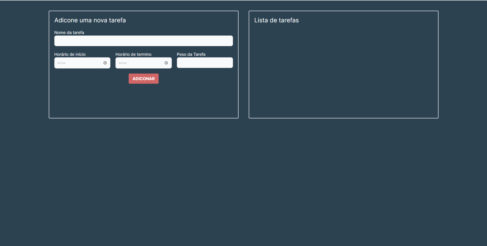
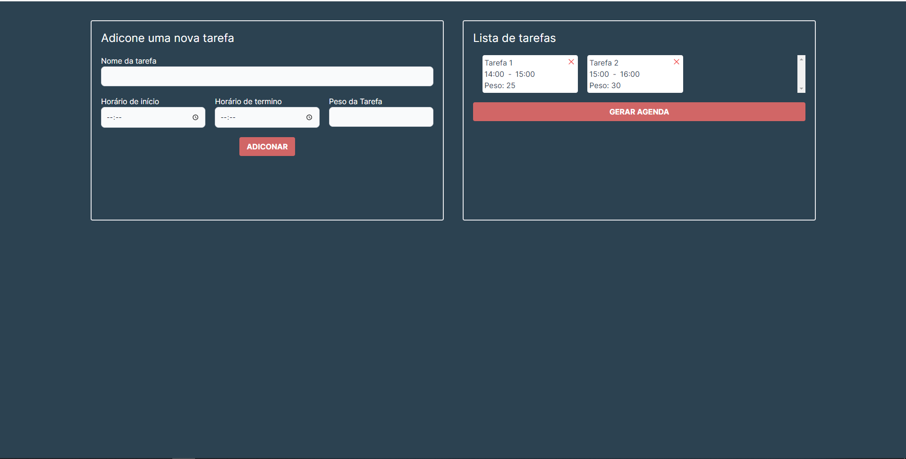
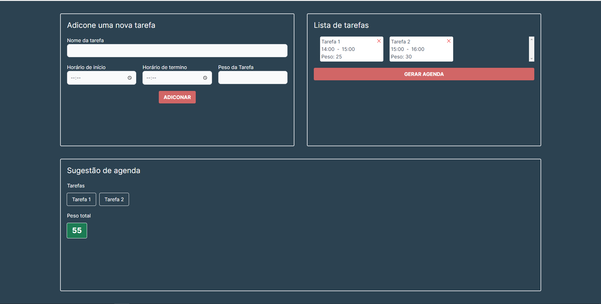

# Agenda

**Número da Lista**: 48<br>
**Conteúdo da Disciplina**: PD<br>

## Alunos

| Matrícula  | Aluno                      |
| ---------- | -------------------------- |
| 19/0015721 | Júlio César Martins França |

## Sobre

O objetivo deste projeto é utilizar o algoritmo Weighted Interval Scheduling para criar uma agenda que leve em consideração não apenas a sobreposição de horários, mas também o peso atribuído a cada tarefa. A agenda apresentará as tarefas que precisam ser realizadas para obter o maior peso possível, que pode ser representado por um valor monetário, por exemplo.

## Screenshots





## Instalação

**Linguagem**: JavaScript<br>
**Framework**: Next.js<br>

### Pré-requisitos

- Ter o [Node.js](https://nodejs.org/en) instalado
- Foi utilizada a v18.16.0 nesse projeto

### Como rodar o projeto

Depois de clonar o repositório:

- Entrar no diretório "agenda"

```
cd agenda/
```

- Instalar as dependências

```
npm install
```

- Rodar o projeto

```
npm run dev
```

O projeto será aberto no link http://localhost:3000/

## Uso

- Após adicionar pelo menos uma tarefa aparecerá o botão GERAR AGENDA
- Clique em GERAR AGENDA para visualizar as tarefas selecionadas e o peso total

## Outros

O vídeo de apresentação se encontra no diretório video.

Após entrar ou voltar para o diretório principal:

```
cd video/
```
